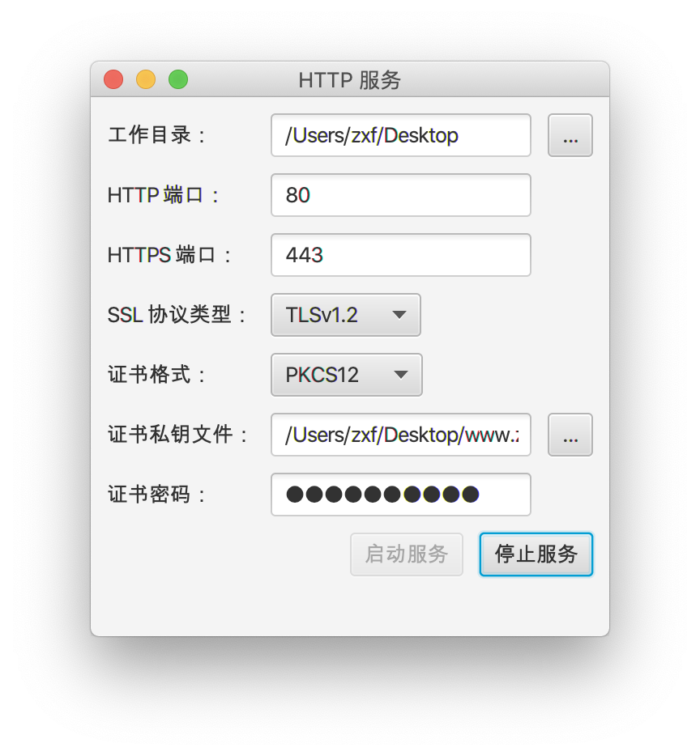

# 简单的 Java HTTP 文件共享服务器（带客户端）

### 运行截图

#### 服务端截图

#### 客户端截图

### Features

- [x] HTTPS
- [ ] 断点续传
- [ ] IO 多路复用

### 支持的 HTTP 方法

#### GET

下载文件

#### PUT

上传文件

### 支持的 HTTP 头

- [ ] HOST
- [ ] ACCEPT_RANGES
- [ ] RANGE
- [ ] CONTENT_RANGE
- [x] CONTENT_LENGTH
- [x] CONTENT_TYPE

### 支持的 HTTP 状态码

- 200 OK
- 201 Created
- 400 Bad Request
- 404 Not Found
- 411 Length Required
- 500 Internal Server Error
- 505 HTTP Version Not Supported